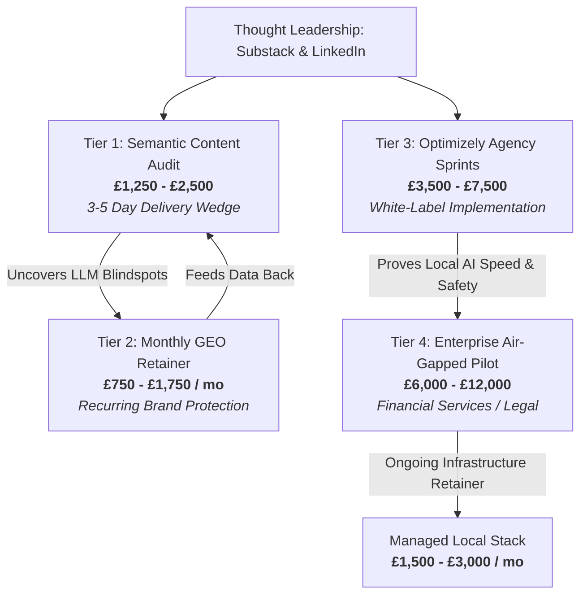
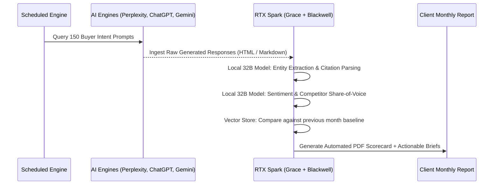

# RTX Spark 128GB: Commercial Master Playbook & Technical Blueprint
**A 4-Tier Productized Services Model for Local AI, GEO, and Enterprise Content-Ops**

**Platform Target**: NVIDIA Grace (20-Core) + Blackwell (RTX 5070-class, 6,144 CUDA cores)  
**Memory Architecture**: 128 GB Unified LPDDR5X (~273 GB/s, NVLink-C2C Coherent)  
**Target Revenue Envelope**: £10,000 – £25,000 / month (Solo Operator / Principal Consultant)  
**Author**: Principal Enterprise Architect / Optimizely SME / AI Systems Strategist  

---

## Executive Summary

The **RTX Spark** laptop represents a paradigm shift for independent technical consultants. Unlike standard discrete-GPU laptops bottlenecked by 8–16 GB of VRAM and high thermal throttling (140W+), the RTX Spark provides a **128 GB coherent unified memory pool at 45–80W TDP**.

Treating this hardware as a standard consumer PC is an anti-pattern. Its true competitive moat is **zero-marginal-cost batch AI inference and 100% offline, air-gapped data sovereignty**.

This blueprint outlines an end-to-end commercial strategy consisting of **four synchronized revenue tiers**:
1. **Tier 1 (The Tactical Wedge)**: *Semantic Content & Cannibalization Audits* (£1,250 – £2,500)
2. **Tier 2 (The Recurring Engine)**: *Monthly Generative Engine Optimization (GEO) Retainers* (£750 – £1,750/mo)
3. **Tier 3 (The Agency Multiplier)**: *Optimizely Content-Ops & Migration Sprints* (£3,500 – £7,500)
4. **Tier 4 (The Enterprise Whale)**: *Air-Gapped Private AI Pilots for Regulated Firms* (£6,000 – £12,000)



---

## 1. Hardware Architecture & Technical Reality Check

Before selling services, the operational envelope of the hardware must be precisely calculated.

### 1.1 Memory Bandwidth vs. Model Sizing Math
Single-token generation in autoregressive LLMs is **memory bandwidth bound**:
$$\text{Tokens/Second} \approx \frac{\text{Memory Bandwidth (GB/s)}}{\text{Model Footprint (GB)}}$$

With ~273 GB/s memory bandwidth over NVLink-C2C:

| Model Tier | Quantization | RAM Footprint | Theoretical Max Speed | Real-World Throughput | Commercial Fit |
| :--- | :--- | :--- | :--- | :--- | :--- |
| **Small (8B–14B)**<br/>*Qwen 2.5 14B, Llama 3.1 8B* | FP16 / Q8 | 16–28 GB | 10–17 tok/s | **12–15 tok/s** | Fast interactive extraction, parsing, alt-text |
| **Medium (27B–32B)**<br/>*Qwen 2.5 32B, Gemma 2 27B* | Q4_K_M / NVFP4 | 18–24 GB | 11–15 tok/s | **10–14 tok/s** | **The Operational Sweet Spot**: High reasoning, low memory, leaves 100GB free |
| **Large (70B–72B)**<br/>*Qwen 2.5 72B, Llama 3.3 70B* | NVFP4 / Q4_K_M | 38–44 GB | 6.2–7.1 tok/s | **5–6.5 tok/s** | Complex strategic reasoning, overnight bulk audit grading |
| **Ultra (120B+)**<br/>*gpt-oss-120B / MoE* | NVFP4 / Q3_K_L | 65–75 GB | 3.6–4.2 tok/s | **3.0–3.8 tok/s** | Deep synthesis, long-context legal doc deep-dives (unattended) |

> [!IMPORTANT]
> **The Bandwidth Insight**: 120B models at ~3.5 tok/s are too slow for interactive customer chat, but **perfect for unattended overnight batch processing**. The sweet spot for synchronous client demos and daily workflow is **27B–32B models in NVFP4 / INT4**, which yield snappy output while leaving over 95 GB of unified memory for concurrent vector stores, OS, and indexing.

### 1.2 Unified Memory Layout Allocation (128 GB Config)
Unlike discrete GPUs where VRAM is fenced off from system RAM, the unified pool is dynamically partitioned:

```text
+---------------------------------------------------------------------------------+
|                                 128 GB Unified RAM                              |
+-------------------+--------------------+-------------------+--------------------+
| 16 GB             | 32 GB              | 20 GB             | 60 GB              |
| OS, WSL2 Kernel,  | Primary Reasoning  | Embedding Model & | Concurrent Tasks,  |
| Windows UI, IDE   | LLM (32B / 70B)    | Qdrant Vector DB  | Fast KV Cache Pool |
+-------------------+--------------------+-------------------+--------------------+
```

### 1.3 Windows on Arm (WoA) & WSL2 Strategy
- **The Pitfall**: Native Windows on Arm can suffer from missing pre-compiled wheels for fast AI dependencies (`flash-attention`, `triton`, certain `bitsandbytes` versions).
- **The Architecture**: Run the entire AI execution stack inside **WSL2 (Ubuntu 24.04 ARM64)**. CUDA for ARM64 Linux is first-class, `vLLM`, `llama.cpp`, and `qdrant-client` compile cleanly, and Docker engine runs natively. Keep the front-end UI and reporting on Windows.

---

## 2. Tier 1: The Tactical Wedge — Semantic Content & Cannibalization Audit

### 2.1 The Pitch
> *"Your website's organic visibility is dropping not because your SEO is bad, but because your pages are cannibalizing each other in vector space, making your site incoherent to AI search engines (ChatGPT Search, Perplexity, Google AI Overviews). We crawl your site, map every page into 1,024-dimensional semantic space, and give you an actionable roadmap in 72 hours."*

### 2.2 Commercial Structure
- **Price**: £1,250 (sites up to 1,500 URLs) | £2,500 (sites up to 10,000 URLs).
- **Turnaround**: 3–5 business days.
- **Gross Margin**: ~98% (zero cloud API fees; runs entirely on RTX Spark).
- **Target Buyer**: Head of Marketing, eCommerce Director, SEO Lead at mid-market B2B brands.

### 2.3 Technical Execution Workflow
1. **Local Crawl**: Fetch target sitemap and extract clean Markdown / inner text using local Python crawler.
2. **Batch Embedding**: Feed chunks into a local embedding model (`bge-large-en-v1.5` or `nomic-embed-text`) running on the Blackwell Tensor Cores.
3. **Clustering & Cosine Similarity**:
   - Compute pairwise cosine similarity across all URL vectors.
   - Flag pairs where similarity $> 0.88$ but target keywords/intents differ (direct semantic cannibalization).
   - Use UMAP + HDBSCAN to discover isolated "orphan" topic clusters and thin clusters ($< 3$ pages).
4. **Local LLM Synthesis (27B/32B)**: Run prompt template across cannibalization pairs to output specific canonicalization, consolidation, or redirect recommendations.

### 2.4 Deliverable Checklist
- [ ] **Interactive Semantic Cluster Map**: HTML/WebGL visualization showing content clusters and cannibalization friction points.
- [ ] **Cannibalization Matrix**: CSV with `Source_URL`, `Conflicting_URL`, `Similarity_Score`, `Recommended_Action` (`301 Redirect`, `Canonicalize`, `Differentiate Content`).
- [ ] **Executive Action Memo**: 3-page plain-English report detailing the top 5 high-impact content repairs.
- [ ] **Upsell Transition**: Presentation of the Tier 2 GEO Retainer to track whether AI search engines cite these repaired pages.

---

## 3. Tier 2: The Recurring Engine — Monthly GEO & AI-Visibility Retainer

### 3.1 The Pitch
> *"Traditional SEO tools tell you where you rank on Google blue links. They don't tell you if ChatGPT Search, Perplexity, Claude, or Google AI Overviews recommend your product when high-intent buyers ask for advice. We continuously track your brand across 200+ buying questions, measure your AI citation share against competitors, and give you exact content updates to win the citation."*

### 3.2 Commercial Structure
- **Monthly Retainer**: £750/mo (Standard: 100 prompts) | £1,450/mo (Enterprise: 300 prompts).
- **Billing Terms**: Quarterly upfront commitment (minimum 3 months).
- **Client Capacity per Operator**: 8–12 clients (£6,000 – £12,000 MRR).
- **Unit Economics**:
  - Cloud API cost to evaluate 1,200 multi-turn queries via Claude 3.5 Sonnet: **~$120/mo/client**.
  - Local RTX Spark inference cost: **~£0.40/mo in electricity**.

### 3.3 Technical Execution Workflow



1. **Prompt Panel Curation**: Assemble 100–300 commercial buyer-intent queries (e.g. *"What is the best enterprise headless CMS for financial compliance in the UK?"*).
2. **Automated Capture Engine**: Scrape responses across 4 major answer engines (ChatGPT Search, Perplexity Pro, Google AI Overviews, Gemini Advanced).
3. **Overnight Bulk Classification (Local LLM)**:
   The RTX Spark runs a local 32B/70B model to evaluate every response:
   - **Mention Status**: Unmentioned (0), Passively listed (1), Top Recommendation (2).
   - **Citation URLs**: Are the client's domains cited in the reference footnotes?
   - **Competitor Dominance**: Which competitor is capturing the primary citation?
   - **Semantic Gap Analysis**: What specific claim or statistic did the winning domain provide that the client's site is missing?
4. **Report Generation**: Automatically compile the monthly delta scorecard with 3 targeted content briefs designed to capture missing citations.

### 3.4 Deliverable Checklist
- [ ] **Monthly AI Visibility Index (AIVI)**: Composite score measuring citation share across engines.
- [ ] **Competitor Incursion Alert**: Highlighting where a competitor recently displaced the client.
- [ ] **Targeted GEO Content Briefs**: 2–3 specific paragraphs and structured data schemas to add to client pages to regain AI engine prominence.
- [ ] **Quarterly 45-Minute Strategy Call**: Reviewing progress and adjusting the prompt panel.

---

## 4. Tier 3: The Agency Multiplier — Optimizely Content-Ops Sprints

### 4.1 The Pitch (White-Label for Digital Agencies)
> *"Your agency has the creative and frontend development covered, but your client's CMS 12 migration or Optimizely Graph rollout is stalled on content operations: missing alt-text across 4,000 assets, non-existent JSON-LD schema, broken taxonomies, and unmapped content blocks. We deploy our specialized local AI toolset directly against your Optimizely APIs to audit, enrich, and migrate thousands of pages in a 10-day sprint."*

### 4.2 Commercial Structure
- **Sprint Pricing**: £3,500 (up to 2,500 pages) | £6,500 (up to 10,000 pages).
- **Engagement Model**: Fixed-scope 2-week sprint; white-labeled under the agency's banner or sold as a specialist partner.
- **Sales Cycle**: 7–14 days (agencies already have budget allocated inside a client's £100k+ replatforming project).

### 4.3 Technical Execution Workflow (Leveraging Workspace Assets)
This tier directly activates your workspace tools:
- [`sme-toolset/standards_applier.py`](file:///c:/Projects/my-research/sme-toolset/standards_applier.py)
- [`sme-toolset/ado_exporter.py`](file:///c:/Projects/my-research/sme-toolset/ado_exporter.py)
- [`rag-assistant/ingest_all_graph_docs.py`](file:///c:/Projects/my-research/rag-assistant/ingest_all_graph_docs.py)

```text
[Agency CMS / Optimizely Graph API]
               |
               v (Parallel GraphQL / REST Ingest via 20-Core Grace CPU)
[Local Memory Ingestion Buffer (128 GB)]
   |--> Blackwell GPU (Vision Model): Batch Alt-Text & Visual Asset Tagging
   |--> Blackwell GPU (32B LLM): Structured Data Synthesis (JSON-LD Breadcrumbs, FAQ, TechArticle)
   |--> Grace Cores: Schema Validation against Optimizely SME Standards
               |
               v
[Automated Azure DevOps Work Items via ado_exporter.py / Direct GraphQL Mutation Push]
```

1. **Parallel Ingest**: 20 Grace cores execute high-concurrency GraphQL queries to pull page content, media assets, and block hierarchies into memory.
2. **Automated Enrichment**:
   - **Accessibility**: Local vision model (e.g. Qwen 2.5 VL 7B) inspects images and writes context-aware, WCAG 2.1 AA compliant alt-text.
   - **Structured Data**: Local LLM synthesizes valid Schema.org JSON-LD tailored for Optimizely CMS blocks.
   - **Taxonomy Normalization**: Clusters disparate tags into clean, hierarchical Optimizely Categories.
3. **Automated Ticketing**: Pass unresolved manual defects directly into the agency's Azure DevOps or Jira backlog using [`ado_exporter.py`](file:///c:/Projects/my-research/sme-toolset/ado_exporter.py).

### 4.4 Deliverable Checklist
- [ ] **Optimizely Graph Ingestion Readiness Audit**: Confirmation that all pages meet GraphQL schema standards.
- [ ] **Batch Media Accessibility Patch**: CSV or API direct-push updating missing image metadata.
- [ ] **JSON-LD Schema Package**: Production-ready structured data blocks ready for CMS integration.
- [ ] **Azure DevOps Work Item Export**: Clean, categorized tickets ready for developers.

---

## 5. Tier 4: The Enterprise Whale — Air-Gapped Private AI Pilots for Regulated Firms

### 5.1 The Pitch (Financial Services, Legal, Healthcare)
> *"Your compliance officers and InfoSec team will not allow customer portfolios, proprietary M&A data, or policy contracts to touch OpenAI or public cloud APIs. We deliver an end-to-end, enterprise-grade AI knowledge system on an encrypted, physically air-gapped machine running inside your own boardroom. No data ever leaves the room. Zero third-party telemetry."*

### 5.2 Commercial Structure
- **2-Week Proof-of-Concept Pilot**: £6,000 – £12,000 (fixed fee).
- **Ongoing Retainer / Infrastructure Advisory**: £2,000 – £3,500/mo (quarterly model updates, fine-tuning, knowledge indexing).
- **Target Buyer**: Chief Risk Officer, General Counsel, Head of Compliance, Chief Digital Officer at mid-tier private banks, asset managers (e.g. Mayfair/City of London firms), or corporate law partnerships.

### 5.3 Technical Execution Workflow (The "Air-Gapped Boardroom Demo")
This utilizes your existing [`rag-assistant`](file:///c:/Projects/my-research/rag-assistant) architecture:

1. **Pre-Demo Preparation**:
   - Package a local RAG stack in an isolated Docker/WSL2 container: [`qdrant_db`](file:///c:/Projects/my-research/rag-assistant/qdrant_db) vector store + local embedding model (`bge-large`) + high-grade local reasoning LLM (Llama 3.3 70B or Qwen 2.5 32B in NVFP4).
   - Clean, dark-mode Web UI (Streamlit, Open-WebUI, or custom lightweight React interface).
2. **The Boardroom Execution (The "Kill Demo")**:
   - Step into the executive conference room with the RTX Spark.
   - Plug into the power outlet and connect to the conference room projector.
   - **Show the attendees that Wi-Fi and Bluetooth are disabled (Airplane Mode ON) and Ethernet is disconnected.**
   - Ingest a 500-page unredacted corporate policy, portfolio prospectus, or standard terms contract live via local drag-and-drop.
   - The 20 Grace cores parse and chunk the PDF in seconds; Blackwell embeds it into Qdrant.
   - Run complex compliance queries: *"Compare section 4.2 of this prospectus against our internal ESG mandate and highlight where we violate exposure limits."*
   - The response generates in seconds with exact paragraph citation anchors.
3. **The Commercial Transition**:
   - Offer the 2-week pilot where you set up this stack on their internal infrastructure (or provide a turnkey dedicated workstation) with custom ingestion pipelines for their document silos.

### 5.4 Deliverable Checklist
- [ ] **Air-Gapped Private RAG Deployment**: Working prototype with internal knowledge base.
- [ ] **TOGAF-Aligned Architecture Decision Record (ADR)**: Formal security and compliance architecture document for InfoSec sign-off.
- [ ] **Data Sovereignty Certificate**: Verification that no network egress occurred during processing.
- [ ] **Enterprise Rollout Roadmap**: Cost-benefit analysis comparing local workstation/on-prem inference against enterprise cloud spend.

---

## 6. The 90-Day Revenue Ramp Plan

A structured roadmap to build, validate, and scale this commercial engine to **£15,000+/month** as a solo operator.

```text
========================================================================================
MONTH 1: FOUNDATION & FIRST WEDGES
========================================================================================
Week 1-2: Toolchain Hardening
  - Set up ARM64 WSL2 Ubuntu AI environment on RTX Spark.
  - Test batch inference benchmarks for Qwen 2.5 32B and Llama 3.3 70B via llama.cpp / vLLM.
  - Finalize the automated Semantic Audit and Cannibalization scripts.
Week 3-4: The Free Case Study
  - Run a free Semantic Content Audit for 1 friendly client or agency partner.
  - Document the findings into a polished case study (anonymized if needed).
  - Pitch 10 warm contacts on the Tier 1 Audit (£1,250). Target: Land 2 paid audits (£2,500).

========================================================================================
MONTH 2: RECURRING RETAINERS & AGENCY PARTNERSHIPS
========================================================================================
Week 5-6: Upsell to Tier 2 (GEO Retainers)
  - Deliver Month 1 audits. Use the findings to pitch the £750/mo GEO Retainer.
  - Target: Convert 1 audit client to a quarterly retainer (£2,250 contract value).
Week 7-8: Agency Partner Outreach (Tier 3)
  - Reach out to 5 Optimizely / Episerver digital agencies.
  - Offer a fixed-scope "Content-Ops Sprint" to rescue delayed CMS 12 migrations.
  - Target: Land 1 agency white-label sprint (£4,500).

========================================================================================
MONTH 3: ENTERPRISE EXPANSION & STEADY STATE
========================================================================================
Week 9-10: Boardroom Demo Preparation (Tier 4)
  - Polish the offline Qdrant + local LLM demo package.
  - Publish 2 technical thought-leadership articles on LinkedIn/Substack on "Why Financial Services Need Air-Gapped AI Workstations".
Week 11-12: Close Enterprise Pilot
  - Conduct 2 boardroom demos with warm corporate/legal contacts.
  - Target: Close 1 enterprise private AI pilot (£8,000).

========================================================================================
STEADY-STATE RUN RATE AT DAY 90:
  - Tier 2 GEO Retainers: 4 clients @ £850/mo   = £3,400 / mo
  - Tier 3 Agency Sprints: 1 sprint / month      = £4,500 / mo
  - Tier 1 Audits: 2 audits / month              = £3,000 / mo
  - Tier 4 Enterprise Pilot (amortized / ongoing) = £4,000 / mo
  -------------------------------------------------------------
  TOTAL ESTIMATED MONTHLY REVENUE:               = £14,900 / month (~£178k/year)
========================================================================================
```

---

## 7. Operational Risk Management & FAQ

### Q: What if an enterprise asks for insurance and SLA guarantees?
**A**: For Tier 1 and Tier 3, position yourself as an advisory and technical services contractor under standard professional indemnity terms (£1M–£2M coverage is standard and cheap in the UK). For Tier 4, you are delivering a proof-of-concept and architecture roadmap, not a critical production SaaS hosting agreement; the software is handed over to their internal IT team.

### Q: How do we handle client skepticism about local vs. cloud AI quality?
**A**: Emphasize that for structured classification, extraction, and domain-specific RAG, a 32B or 70B state-of-the-art open model (e.g. Qwen 2.5 32B or Llama 3.3 70B) matches or exceeds GPT-4o on narrow tasks, with zero risk of prompt leakage, training on client data, or API downtime.

### Q: Why not just buy an M4 Max MacBook Pro with 128GB?
**A**: Apple Silicon is exceptional for raw memory bandwidth, but it lacks **native NVIDIA CUDA, TensorRT-LLM, and hardware FP4 tensor cores**. Most enterprise AI tooling, custom kernels, and production frameworks (including Optimizely's ecosystem and Windows-based client pipelines) are designed around CUDA and Windows/Linux. The RTX Spark bridges the portability of a laptop with the native CUDA ecosystem of the data center.

---

## 8. Next Steps & Implementation Artifacts

To begin executing this blueprint immediately, the following code modules in this workspace can be activated:
1. **Semantic Audit Engine**: Combine local embeddings with UMAP clustering scripts under `scripts/`.
2. **GEO Prompt Ingestion Engine**: Build the scheduled batch query panel under `scripts/geo_tracker/`.
3. **Optimizely Automation Scripts**: Leverage [`sme-toolset/standards_applier.py`](file:///c:/Projects/my-research/sme-toolset/standards_applier.py) for agency sprints.
4. **Air-Gapped RAG Container**: Package [`rag-assistant/query_optimizely_assistant.py`](file:///c:/Projects/my-research/rag-assistant/query_optimizely_assistant.py) with a local Streamlit interface.
